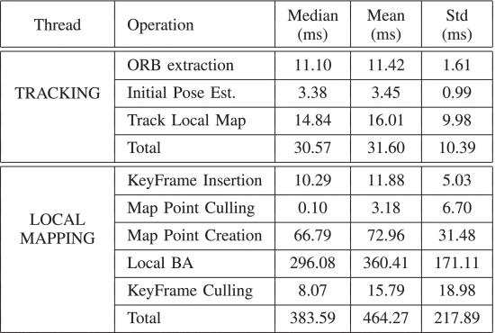
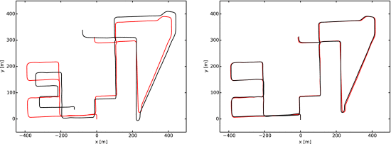

# ORB-SLAM
この記事はORB-SLAMの記事になります。
以下の論文２つを参照しORB-SLAMの概要、進化を中心に書いていきます。
Raúl Mur-Artal
- [ORB-SLAM: A Versatile and Accurate Monocular SLAM System](https://webdiis.unizar.es/~raulmur/MurMontielTardosTRO15.pdf)

- [ORB-SLAM2: an Open-Source SLAM System for Monocular, Stereo and RGB-D Cameras](https://arxiv.org/abs/1610.06475)


## SLAMとは[1]

最近では自動運転などで聞かれる言葉かもしれません。

SLAMとは、「Simultaneous Localization and Mapping」の頭文字をとってSLAM(スラム)と呼びます。
位置特定と地図作成を同時に行うという技術です。


このSLAMはロボットのナビゲーションや自動運転にはとても重要な分野です。
この先どのような場所になっているかを計算機に入れることで危険を回避できる可能性や最適な経路を見つける手助けになります。

SLAM以下のようなセンサーを使い作成します。

- LiDAR SLAM
- Visual SLAM
- Depth SLAM

今回はORB-SLAMはこのVisual SLAMに該当します。

## ORB-SLAMの目的
Visual SLAMの原理は２次元画像から3次元を構成しようというStructure from Motionに基づいていました。

### Structure from Motion[2]
複数のカメラから撮影した画像を使って,カメラの位置と向き,そして撮影された物体の形を3次元的に推定する方法です.

まず,画像間で共通の特徴点を見つけて,その特徴点の位置関係からカメラの位置と向きを推定します.

次に,推定したカメラの情報を使って,特徴点の3次元位置を計算します。

これを画像を追加しながら繰り返して,最終的にカメラと物体の3次元形状を高精度に推定します.

この原理を元に当初Visual SLAMは作成されていました。


## 関連研究


しかし、以下のような課題が生まれていました。

1. **深度情報の不足**: 単眼カメラは、ステレオカメラや深度センサーのように直接的な深度情報を提供しません。そのため、画像から3Dの構造を推測する必要があり、これは複雑な計算処理を要する作業です。

2. **動的な環境への対応**: 動く物体や照明の変化など、動的な環境での操作は、正確な地図作成を複雑にします。これは、実際の環境を正確に反映するためには、継続的な更新と調整が必要であるためです。

3. **計算リソースの制約**: リアルタイム性能を実現するためには、高速で効率的な計算が求められます。しかし、単眼SLAMにおける複雑な計算処理は、特にリソースが限られた環境では大きな制約となります。

4. **スケールの曖昧さ**: 単眼カメラによるSLAMでは、スケール（物体の実際の大きさ）が不確定な場合があります。これは、単眼カメラから得られる情報だけでは、物体のサイズを正確に推定することが難しいためです。

5. **特徴抽出とマッチングの課題**: 環境内の特徴点を抽出し、これらの点を異なるフレーム間で正確にマッチングすることが必要です。しかし、テクスチャが少ない環境や照明条件が悪い場合など、特徴抽出が難しい状況では、このプロセスの精度が低下します。
これらの問題に対処するためにORB-SLAMは作成されました。

## ORB-SLAMのシステム概要


上記のようなシステムで構成されます。
1. **特徴抽出とマッチング**
   ORB-SLAMはORB（Oriented FAST and Rotated BRIEF）特徴を使用します。これは、計算効率が高く、回転に対して不変で、スケールの変化にも頑健な特徴記述子です。システムはこれらの特徴点を抽出し、フレーム間でのマッチングに使用します。
2. **Traking, Loop Closing,Local Mappingの並列処理**
   ORB-SLAMシステムは、Tracking（追跡）、Local Mapping（局所的なマッピング）、Loop Closing（ループクロージング）の三つのスレッドを並列に実行します。これらの各スレッドの役割は以下の通りです：
   1. **Tracking（追跡）**: カメラの位置を各フレームで局在化し、新しいキーフレーム(ビデオフレーム)を挿入するタイミングを決定します。まず、前のフレームとの初期的な特徴マッチングを行い、運動のみのバンドル調整（BA）を使用してポーズ（姿勢）を最適化します。
   2.  **Local Mapping（局所的なマッピング）**: 新しいキーフレームを処理し、カメラの姿勢の周囲で最適な再構成を達成するために局所的なBAを実行します。新しいキーフレームにマッチしないORB特徴の新しい対応関係を、共視性グラフ内の接続されたキーフレームで探し、新しいポイントを三角測量します。また、冗長なキーフレームを削除する役割も担います。
   3.  **Loop Closing（ループクロージング）**: 新しいキーフレームごとにループを探索し、検出します。ループクロージングは、地図の精度を高めるために重要であり、長いシーケンスにおける誤差の蓄積を補正する役割を果たします。

3. **MAP作成**
  - KeyFrameの定義
     - [ワールド座標系](https://cgworld.jp/terms/%E3%83%AF%E3%83%BC%E3%83%AB%E3%83%89%E5%BA%A7%E6%A8%99%E7%B3%BB.html)でのカメラ姿勢（外部パラメータ）
     -  カメラの内部パラメータ
     -  ORB特徴点
  - 柔軟な地図を作成
  
  - CovisibilityグラフとEssentialグラフの定義


  **コビジビリティグラフ（Co-visibility Graph）**

  - コビジビリティグラフは、キーフレーム間の共視関係を表します。すなわち、どのキーフレームが同じ環境の部分を観測しているかを示します。
  - グラフの各ノードはキーフレームを表し、エッジは二つのキーフレーム間に共通する観測点（例えば、特徴点）が存在することを示します。
  - このグラフは、SLAMシステムがマップを構築し、ローカリゼーションを行う際に、関連性の高いキーフレームを識別するのに役立ちます。
  - キーフレーム間の共視関係が強いほど、そのエッジはより重要と見なされます。

  **エッセンシャルグラフ（Essential Graph）**

  - エッセンシャルグラフは、コビジビリティグラフを基に構築され、SLAMシステムにおけるグローバルな最適化に使われます。
  - このグラフは、共視関係だけでなく、ループクロージングの情報も統合します。つまり、キーフレーム間の空間的な関係とループクロージングの制約を両方含みます。
  - エッセンシャルグラフにおける最適化は、マップ全体の一貫性を保ちつつ、誤差の蓄積を最小限に抑えるのに役立ちます。
  - このグラフを使うことで、SLAMシステムはより正確でスケールに一貫したマップを生成することができます。

  これらのグラフは、SLAMシステムが複雑な環境を効率的にナビゲートし、高精度なマッピングを実現するのに不可欠なツールです。ORB-SLAMのようなシステムでは、これらのグラフがシステムの性能と精度を大きく向上させる重要な要素となっています。


4. **場所を認識するようのデータベースを作成**
   - DBoW2[4]から着想を得たBag of Wordsモデルに基づいた場所認識
5. **マップの初期化**
   1. 現在のKeyFrane(F_c)と参照するKeyFramee(F_r)のORBの特徴量から対応関係X_c(現在)とX_r(参照)を見つける。
   2. ２つのモデルから[ホモグラフィ推定](https://qiita.com/hibiki_810/items/464e222f2a4071c48a54)
   
   
   ```math
   \begin{equation} {\bf x}_c = {\bf H}_{cr} \, {\bf x}_r, \quad {\bf x}_c^T \, {\bf F}_{cr} \, {\bf x}_r = 0 \end{equation}
   ```
   3. それぞれDLTアルゴリズムと８点アルゴリズムを使用し反復最適化を行う
   ```math
   \begin{align} S_M &=& \sum _i \big (\rho _M \big (d_{cr}^2({\bf x}_c^i,{\bf x}_r^i,M)\big) \nonumber \\ &&+\; \rho _M (d_{rc}^2\big ({\bf x}_c^i,{\bf x}_r^i,M)\big) \big) \nonumber \\ \rho _{M} (d^2) &=& \left\lbrace \begin{array}{ll}\Gamma - d^2, & \textrm {if} \quad d^2 < T_M \\ 0, & \textrm {if} \quad d^2 \ge T_M \end{array}\right. \end{align}
   ```
   4. モデルM（H はホモグラフィ、F は基本行列）に対するスコア SMを計算します
   5. モデル選択をします平面か非平面可を視差が十分でないかを判定(RH>0.45)
   ```math
   \begin{equation} R_H = \frac{S_H}{S_H+S_F} \end{equation}
   ```
   6.  モデルが選択されたときに生じる仮説軍の正しいものを選択
   ```math
   \begin{equation} {\bf E}_{rc} = {\bf K}^{T} \, {\bf F}_{rc} \, {\bf K} \end{equation}
   ```
   7. バンドル調整
  上: PTAM、中央: LSD-SLAM、下: ORB-SLAM
  PTAM と LSD-SLAM は破損した平面解を初期化しますが、ORB-SLAMは十分な視差が検出されたときに基本行列から自動的に初期化されます
 


**セクションV: トラッキング（Tracking）**

セクションVでは、ORB-SLAMシステムにおけるトラッキングのプロセスが詳細に説明されています。トラッキングはカメラのポーズ（姿勢）を各フレームで最適化する過程であり、以下のステップが含まれます：

- カメラのポーズ最適化（運動のみのバンドル調整）
- 新しいキーフレームの挿入の判断

このセクションでは、トラッキングスレッドが各フレームで実行するステップが詳述されています
**セクションVI: ローカルマッピング（Local Mapping）**

セクションVIでは、ORB-SLAMにおけるローカルマッピングプロセスについて詳述されています。このプロセスは、新しいキーフレームを処理し、カメラの周囲で最適な3D再構築を達成するための局所的なバンドル調整（BA）を含みます。具体的なステップは以下の通りです：

- 新しいキーフレームの処理
- 未マッチングのORB特徴点に対する新しい対応関係の検索
- 高品質ポイントの保持のための厳格なポイント除去ポリシー

ローカルマッピングはまた、冗長なキーフレームの除去も担当します。

**セクションVII: ループクロージング（Loop Closing）**

セクションVIIでは、ORB-SLAMのループクロージングのプロセスが詳細に説明されています。ループクロージングは、SLAMシステムが以前に訪れた場所を再訪した際の誤差を補正するために重要なプロセスです。具体的なステップは以下の通りです：

- ループの検出
- 類似変換（Sim(3)変換）の計算
- ループの両側の調整と重複する点の統合
- エッセンシャルグラフ上でのポーズグラフ最適化

このセクションでは、ループ検出と補正のステップが詳述されており、Levenberg–Marquardtアルゴリズムを使用した最適化が行われます。
## 結果
NewCollege での時間の追跡とマッピング

NewCollege のループ終了時間

TUM RGB-D ベンチマークにおけるキーフレーム ローカリゼーション エラーの比較

## 結論と考察
しかし、まだ弱点があります。
1. **キーフレームとマップポイントの選択**: キーフレームの数が増えるにつれて、システムの複雑さも増大します。したがって、キーフレームの選択においては不必要な冗長性を避ける必要があります。適切なキーフレームとマップポイントの選択は、システムの効率性と精度に直接的な影響を与えます。

2. **計算コスト**: 高精度な結果を達成するためには、SLAMアルゴリズムはバンドル調整（BA）に対して適切な観測データを提供する必要があります。これには、選択されたフレーム（キーフレーム）間のシーン特徴（マップポイント）の対応関係が含まれます。高度な処理は計算コストが高くなるため、リアルタイムでのSLAM処理においては計算コストを抑える工夫が必要です。

3. **キーフレームとポイントのネットワーク構成**: 正確な結果を得るためには、キーフレームとポイントの強力なネットワーク構成が必要です。これには、観測点を持つキーフレームの適切な分布と、十分なパララックスを持つ点、そして多くのループクロージャマッチが含まれます。

これらの弱点は、ORB-SLAMが直面する主要な課題であり、これらを克服することでさらなる性能の向上が期待されます。

## ORB-SLAM2の誕生
ORB-SLAMの弱点を補うべくORB-SLAM2を作成しました。
- 1 台のカメラだけでは深度を観測できないため、地図の縮尺や推定軌道は不明
- システム ブートストラップでは、最初のフレームから三角測量することができない
- 単眼カメラを使用する場合、ORB-SLAMは絶対スケールを推定できず、復元されたマップのスケールは初期化時の条件に依存します。
これらの問題をORB-SLAM2は以下のように解決します。
- ループクローズ、再ローカリゼーション、マップ再利用を含む、単眼カメラ、ステレオカメラ、RGB-D カメラ用の初のオープンソースSLAM システム。

- RGB-D の結果は、バンドル調整 (BA) を使用することで、反復最近接点 (ICP) または測光誤差と深度誤差の最小化に基づく最先端の方法よりも高い精度を達成できることを示しています。

- 近いおよび遠いステレオ ポイントと単眼観察を使用することにより、ステレオ結果は最先端の直接ステレオ SLAM よりも正確になります。

- マッピングを無効にした状態でマップを効果的に再利用できる軽量のローカリゼーション モード。
- 
ORB-SLAMとORB-SLAM2の主な違いは以下の通りです。

- ORB-SLAMは単眼カメラのみをサポートしていたのに対し、ORB-SLAM2はステレオカメラとRGB-Dカメラにも対応している。（単眼でも可能です）

- ORB-SLAM2はループクローズ機能を追加しており、マップのドリフトを補正できる。 

- ORB-SLAMはスケールの推定が不可能だったが、ORB-SLAM2はステレオあるいはRGB-Dデータからスケール情報を得ることができる。

- ORB-SLAM2は局所化モードを追加しており、マッピングを無効にして軽量な長期localizeが可能。

- ORB-SLAM2はグラフ最適化後にフルバンドル調整を行い、最適な構造と運動のソリューションを計算できる。

- ORB-SLAM2は再localizationとマップの再利用が可能。

- ORB-SLAM2はオープンソースで公開されており、研究者向けの実用的なSLAMソリューションを提供している。

つまり、ORB-SLAM2はループクローズ、スケール推定、再利用性などの機能を追加し、ステレオとRGB-Dに対応することで、ORB-SLAMの汎用性と精度を大きく向上させたSLAMシステムだと言えます。
## ORB-SLAM2のシステム概要
(a) システムのスレッドとモジュール。(b) 入力の前処理。


ORB-SLAM2のシステム概要は以下のようになっています。

- 入力: 単眼カメラ、ステレオカメラ、RGB-Dカメラ

- 前処理: 特徴点(ORB特徴量)の抽出とステレオマッチングまたは深度値からの仮想視点生成

- システムスレッド: 
   - トラッキング: 現在のフレームの姿勢推定
   - ローカルマッピング: ローカルマップの管理と最適化
   - ループクローズ: ループ検出とドリフトの補正
   - 全体最適化: ループクローズ後のフルバンドル調整

- 再局在化: トラッキングロスト時の姿勢回復

- マップの再利用: 一度マップを作成すれば、後で再利用可能

- 局所化モード: マッピングを無効にして軽量な長期localize

- 最適化: モーション限定BA、ローカルBA、全体BA

- 出力: キーフレームの姿勢、スパースな地図
###  単眼、近距離ステレオ、遠距離​​ステレオのキーポイント

- 入力を前処理して顕著なキーポイントの位置で特徴を抽出します。
- この画像は使われないので特徴量のみを使用する
- 単眼キーポイントとステレオ キーポイントを処理し、ステレオキーポイントは、3つの座標 `xs=(uL, vL, uR)` によって定義されます。ここで、`(uL, vL)` は左側の画像上の座標、`uR` は右側の画像上の水平座標です。ステレオカメラの場合、両方の画像でORB（Oriented FAST and Rotated BRIEF）を抽出し、左側の画像の各ORBに対して、右側の画像でマッチする点を探します。ステレオ画像が整流されていると仮定すると、エピポーラ線が水平になるため、この処理は非常に効率的に行えます。その後、左側のORBの座標と右側のマッチする点の水平座標でステレオキーポイントを生成します。右側のマッチする点の座標は、パッチ相関によってサブピクセルレベルで精緻化されます。RGB-Dカメラの場合、RGB画像上でORB特徴を抽出し、Strasdatらによって提案されたように、座標 `(uL, vL)` を持つ各特徴の深度値 `d` を仮想的な右側の座標に変換します。

要するに最初のカメラだけではカメラの推定できないよねだから右手側のカメラ作っちゃおという式です。
```math
\begin{equation} u_R = u_L - \frac{f_x b}{d} \end{equation}
```
RGB-Dカメラの場合に深度値から仮想の右目視点を生成する計算式です。
u_R : 右目の水平方向の画素位置
u_L : 左目の特徴点の水平方向の画素位置
f_x : 水平方向の焦点距離
b : ベースライン(ProjectorとInfraredカメラの間の距離)
d : 深度値

つまり、左目の特徴点の画素位置と深度値から、ステレオカメラを想定した場合の右目の画素位置を計算しています。

### システムのブートストラップ
最初の画像から初期マップ作成可能
### 単眼およびステレオ制約によるバンドル調整
バンドル調整では、3次元の地図点Xiとカメラの姿勢(回転R, 位置t)を最適化することで、再投影誤差を最小化します。
- モーション限定BAで、マッチングされた地図点Xiとその観測である単眼キーポイントxim やステレオキーポイントxisの再投影誤差を最小化しています。
```math
\begin{equation} \lbrace \mathbf {R}, \mathbf {t}\rbrace = \text{argmin}_{\mathbf {R}, \mathbf {t}} \sum _{i\in \mathcal {X}} \rho \left(\left\Vert \mathbf {x}^i_\mathrm{(\cdot)}-\pi _\mathrm{(\cdot)}\left(\mathbf {R}\mathbf {X}^i + \mathbf {t}\right)\right\Vert ^2_\Sigma \right) \end{equation}
```
- 投影関数で、単眼とステレオカメラのケースを定義しています。
```math
\begin{align} \pi _\mathrm{m} \left(\left[\begin{array}{c}X\\ Y\\ Z\end{array}\right] \right) = {\left[\begin{array}{c}f_x\frac{X}{Z} + c_x\\ [0.2em] f_y\frac{Y}{Z} + c_y \end{array}\right]},\quad \pi _\mathrm{s} \left({\left[\begin{array}{c}X\\ Y\\ Z\end{array}\right]} \right) = {\left[\begin{array}{c}f_x\frac{X}{Z} + c_x\\ [0.2em] f_y\frac{Y}{Z} + c_y \\ [0.2em] f_x\frac{X-b}{Z} + c_x\end{array}\right]} \nonumber\\ \end{align}
```
- ローカルBAで、最適化するローカル領域のkeyframeとpointを定義し、その観測誤差を最小化しています。
```math
\begin{align} \lbrace \mathbf {X}^i, \mathbf {R}_l, \mathbf {t}_l | i\in \mathcal {P}_L, l\in \mathcal {K}_L\rbrace & =& \text{argmin}_{\mathbf {X}^i, \mathbf {R}_l, \mathbf {t}_l} \sum _{k\in \mathcal {K}_L\cup \mathcal {K}_F} \sum _{j\in \mathcal {X}_k} \rho \left(E(k,j)\right) \nonumber \\ E(k,j) &=& \left\Vert \mathbf {x}^j_\mathrm{(\cdot)}-\pi _\mathrm{(\cdot)}\left(\mathbf {R}_k\mathbf {X}^j + \mathbf {t}_k\right)\right\Vert ^2_\Sigma . \end{align}
```
単眼とステレオの観測を統一的に扱えるようにして、姿勢と地図点の最適化を行うことで、高精度の推定を実現しているということです。グローバル最適化がORB-SLAM2の強みです。
### ループの終了とフル BA
ループクローズは次の2ステップで行われます。

ループの検出と検証
ポーズグラフ最適化によるループの補正
ステレオやRGB-Dカメラを使うことでスケールが直接観測可能なため、ループの幾何検証やポーズグラフ最適化は、スケールドリフトを考慮する必要がなくなり、剛体変換で表現できます。

ORB-SLAM2では、ポーズグラフ最適化の後にフルBA(全体最適化)を実行して最適解を得ています。これはコストが高いため別スレッドで実行されます。

## 結果
KITTI データセットの精度の比較



TUM RGB-D fr3_office、fr1_room、fr2_desk、およびfr3_nstの推定されたキーフレーム ポーズとセンサー深度マップからの密な点群の再構築。


## 参考文献
KITTI データセットの精度の比較
[1][SLAM（スラム）とは？？～SLAMの基本技術と活用について～](https://www.macnica.co.jp/business/maas/columns/134751/)
[2][SfM (Structure from Motion)](http://www.sanko-shoko.net/note.php?id=gny3)
[3][ORB-SLAMの手法解説](https://www.slideshare.net/MasayaKaneko/orbslam-84842802)
[4][DBoW2](https://github.com/dorian3d/DBoW2)
## より勉強するために

[SLAMって何だ？ザックリまとめ](https://qiita.com/khigashimoto/items/e92c25786dee3e87a778)
[Bags of Binary Words for Fast Place Recognition in
Image Sequences](http://doriangalvez.com/papers/GalvezTRO12.pdf)
